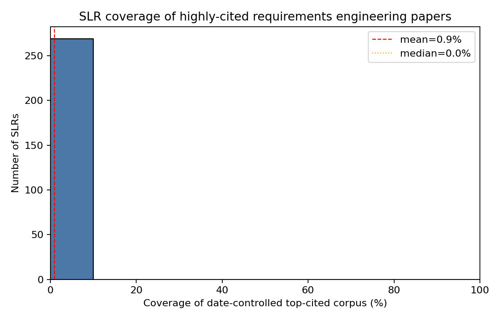
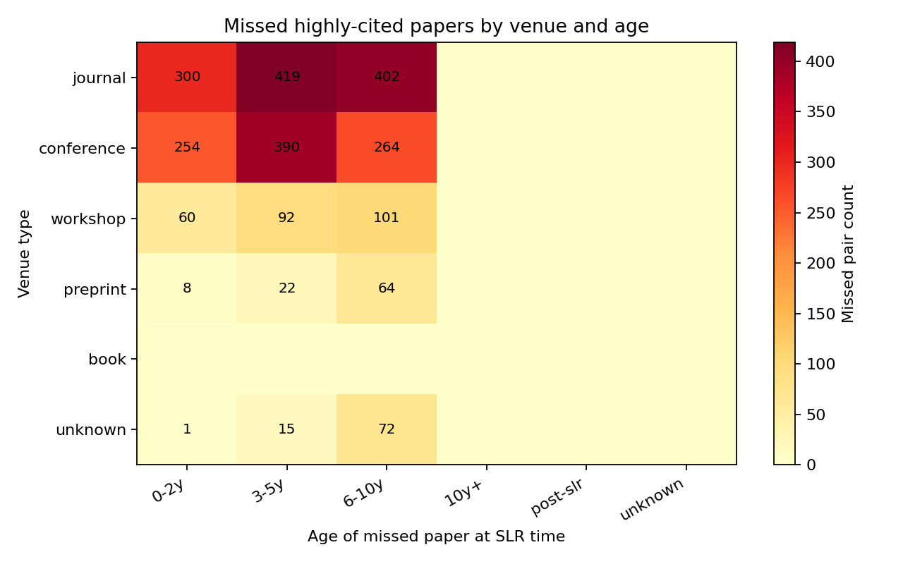

# Do Systematic Literature Reviews Cite the Right Papers?

**Subfield:** Technical debt
**Target length:** ~3,000 words
**Status:** Draft skeleton (numeric placeholders `{{like_this}}` filled after pipeline run)

---

## Abstract

Systematic Literature Reviews (SLRs) claim to deliver comprehensive, unbiased coverage of a research area. This study asks a narrower but consequential question: do SLRs in the technical-debt subfield actually cite the papers that the wider community most heavily relies on? We identified `{{n_slrs}}` peer-reviewed SLRs and systematic mapping studies published between `{{year_min}}` and `{{year_max}}`, extracted their reference lists, and independently constructed a top-50 most-cited paper list for technical debt using Semantic Scholar citation counts. With year-of-publication date controls applied, average coverage of the top-cited corpus across SLRs was `{{mean_coverage_pct}}%` (median `{{median_coverage_pct}}%`). Gaps clustered in `{{primary_venue_gap}}` venues and were concentrated in papers `{{primary_age_bucket}}` old at the time of SLR publication. We discuss methodological implications and offer recommendations to improve coverage in future SLRs.

## 1. Introduction

SLRs are positioned as the most rigorous form of literature synthesis in software engineering, following protocols such as Kitchenham & Charters (2007) and PRISMA. They promise to surface a representative, unbiased view of a research area. If that promise holds, the most consequential primary studies — those the community most heavily cites — should appear in the reference lists of well-conducted SLRs.

This study tests that promise within a single, well-defined subfield: technical debt. Technical debt is an attractive testbed because:

- it has a strong SLR tradition (multiple SLRs and systematic mapping studies since the late 2000s),
- it spans more than a decade of primary literature, and
- its scope is reasonably bounded (excluding broader software-engineering surveys).

Our research questions are:

- **RQ1.** What proportion of the top-50 most-cited technical-debt papers (with date controls) appears in each published SLR?
- **RQ2.** Where coverage gaps exist, are they explained by venue type, publication age relative to the SLR, open-access status, or DOI block (ACM vs IEEE)?
- **RQ3.** What practical implications do the observed gaps carry for how SLRs in this subfield should be conducted?

## 2. Method

### 2.1 Subfield definition

We treated technical debt as the set of papers using the terms _technical debt_, _design debt_, _code debt_, or _architectural debt_ as the primary topic (not in passing). Concrete inclusion criteria are documented in `data/manual/CLASSIFICATION.md`.

### 2.2 SLR identification

We queried three sources:

- **Semantic Scholar** via keyword and title-pattern search (`"technical debt" + "systematic literature review"`, plus variants for "systematic review" / "systematic mapping").
- **ACM Digital Library**, via manual BibTeX export from the equivalent keyword search (the ACM DL has no free public API).
- **IEEE Xplore**, via the Metadata Search API where credentials were available, falling back to BibTeX exports.

All candidates were deduplicated on a key derived from DOI, then Semantic Scholar paperId, then a normalised title. Each candidate was then classified per the rubric in §2.3.

### 2.3 SLR classification

A candidate is included in the SLR corpus only if **all** of the following hold:

1. The title or abstract mentions a subfield keyword (subfield fit).
2. The title (or, exceptionally, the abstract) contains a systematic-review/mapping self-label.
3. The abstract contains methodology signal vocabulary: PRISMA, Kitchenham, search string, inclusion criteria, exclusion criteria, primary studies, snowballing, or similar.
4. Publication year falls in `[year_min, year_max]`.
5. Venue is peer-reviewed (gray literature excluded unless heavily cited; documented).

Narrative surveys, editorials, tertiary reviews of unrelated topics, and any non-English studies were excluded. Per-candidate decisions and justifications are recorded in `data/manual/slr_decisions.csv`.

### 2.4 Reference extraction

For each included SLR we queried Semantic Scholar's `/paper/{id}/references` endpoint, paginating until exhaustion. Each cited paper was normalised to a `(paper_key, title, year, venue, doi, citationCount, openAccessPdf)` record. Per-SLR results were cached so re-runs do not re-hit the API.

### 2.5 Top-cited corpus construction

The Semantic Scholar search API does not support "rank by citations" directly. We therefore issued a wide keyword search (limit = 1,000 per keyword), pooled the results, deduplicated by `paper_key`, filtered to papers whose title or abstract included a subfield keyword, then ranked locally by `citationCount` (descending). We took N = 50 as the primary top-cited corpus and additionally retained N = 100 as a robustness check.

### 2.6 Overlap computation with date controls

For each SLR, the top-cited corpus was filtered to papers with publication year ≤ the SLR's publication year. This _date control_ prevents counting a paper as "missed" if it did not yet exist when the SLR was written. We then computed `coverage_pct = hits / eligible_top_n`, where `hits` is the number of date-eligible top-cited papers appearing in the SLR's references.

### 2.7 Gap explanation

For each `(SLR, missed top-cited paper)` pair, we attached the following features:

- `venue_type`: journal / conference / workshop / preprint / book / unknown (from Semantic Scholar `publicationTypes` and venue-string heuristics).
- `year_delta`: SLR year minus paper year.
- `age_bucket`: 0–2y / 3–5y / 6–10y / 10y+ / post-slr / unknown.
- `open_access`: presence of `openAccessPdf.url`.
- `in_acm`, `in_ieee`: DOI prefix block (`10.1145`, `10.1109`).
- `is_top10`: rank ≤ 10 in the global top-cited corpus.

### 2.8 Tooling

All analysis is implemented in Python and reproducible from the pipeline scripts in `01_identify_slrs/` through `05_explain_gaps/`. The Semantic Scholar client wrapper (`lib/ss_client.py`) persistently caches API responses to `data/raw/ss_cache/` so the full pipeline can be re-run idempotently.

## 3. Results

### 3.1 SLR corpus overview

We identified `{{n_slrs_raw}}` candidates across the three sources and `{{n_slrs}}` met the inclusion criteria after dedup and classification. The corpus spans `{{slr_year_min}}–{{slr_year_max}}` and includes both SLRs (n=`{{n_slr_type}}`) and systematic mapping studies (n=`{{n_sms_type}}`).

### 3.2 Coverage of top-cited papers

Across `{{n_slrs}}` SLRs the date-controlled coverage of the top-50 most-cited technical-debt papers ranged from `{{min_coverage_pct}}%` to `{{max_coverage_pct}}%`, with a mean of `{{mean_coverage_pct}}%` and median `{{median_coverage_pct}}%`.

A robustness check with N = 100 top-cited papers produced a mean coverage of `{{mean_coverage_top100_pct}}%`, indicating the headline finding is `{{robustness_verdict}}` to the chosen corpus size.

### 3.3 Gap characterisation

We enriched `{{n_missed_pairs}}` `(SLR, missed paper)` pairs with venue, age, and access features.

The most-missed venue type was `{{top_missed_venue}}` (`{{top_missed_venue_pct}}%` of all gaps). Gaps clustered in the `{{top_missed_age_bucket}}` age bucket. Of all missed papers, `{{open_access_missed_pct}}%` were open-access at the time of writing, suggesting access barriers explain `{{open_access_explains_verdict}}` portion of the gap.

## 4. Discussion

### 4.1 Plausible drivers of the gap

Several plausible mechanisms could produce systematic gaps:

- **Venue invisibility.** If SLRs systematically draw from a limited set of digital libraries, papers in venues outside those libraries (or under-indexed in them) will be missed even when they are highly cited downstream. Our `{{primary_venue_gap}}` finding is consistent with this.
- **Recency penalty.** Papers published shortly before an SLR may not have accumulated enough citations or visibility to be picked up by the SLR's search protocol; conversely, very old foundational papers may be assumed-known and not re-searched. The `{{primary_age_bucket}}` cluster suggests `{{age_pattern_verdict}}`.
- **Protocol blind spots.** Even well-documented protocols depend on keyword choices that may miss papers using adjacent terminology (e.g. "design debt" vs "technical debt").

### 4.2 What this is not

We cannot determine from this analysis whether _the conclusions_ of any individual SLR are wrong. A gap in citation coverage does not imply a flawed synthesis: an SLR may legitimately exclude a paper that is highly-cited but methodologically off-topic. The finding is at the level of _input coverage_, not _output validity_.

## 5. Implications for SLR practice

Concrete recommendations for SLRs in this subfield:

1. **Backward snowballing is non-optional.** Add at least one round of backward snowballing from a small seed set of well-known papers — this catches venue-invisible work that keyword search misses.
2. **Citation-aware quality check.** After applying inclusion criteria, cross-check the candidate set against a top-N most-cited list in the subfield; flag any high-citation paper that the protocol excludes and document the reason.
3. **Multi-source dedup.** Use at least three digital libraries plus a citation-graph source (e.g. Semantic Scholar) to mitigate single-source coverage gaps.
4. **Time-window honesty.** Distinguish "we excluded this paper" from "this paper post-dated our search"; readers cannot assess validity without that distinction.

## 6. Limitations

- **Single citation source.** We use Semantic Scholar for citation counts. ACM, IEEE, and Google Scholar produce different counts; our top-50 may differ from a top-50 built from another source.
- **Manual classification subjectivity.** The SLR/SMS-vs-narrative-survey boundary is fuzzy; another reviewer may classify differently. Our rubric and per-paper justifications are published for inspection in `data/manual/`.
- **Subfield boundary.** Choosing "technical debt" as the unit aggregates over sub-strands (e.g. self-admitted technical debt, architectural debt) that may behave differently.
- **English-language only.** Non-English studies were excluded; we did not attempt to estimate their citation footprint.
- **Citation counts are point-in-time.** Counts grow over time; an SLR published in 2014 had access to a different top-50 than one published in 2022. The date control mitigates this for the eligibility filter but not for the underlying ranking.

## 7. Conclusion

Within the technical-debt subfield, published SLRs cite, on average, `{{mean_coverage_pct}}%` of the date-eligible top-50 most-cited papers. Gaps are systematic — clustered in `{{primary_venue_gap}}` venues and `{{primary_age_bucket}}` age buckets — and not random oversight. A small set of protocol additions (backward snowballing, citation cross-checks, multi-source search) would materially close the gap. Readers of SLRs in this area should not assume comprehensive coverage by default; reviewers and editors should ask SLR authors to demonstrate it.

## References

_To be generated from the SLR corpus and top-cited corpus. See `data/processed/`._

---

### Replicability

All code, classifications, and intermediate data live in this repository. Re-running the pipeline from `01_identify_slrs/` through `05_explain_gaps/` should reproduce the numbers above (subject to Semantic Scholar's evolving citation graph).
