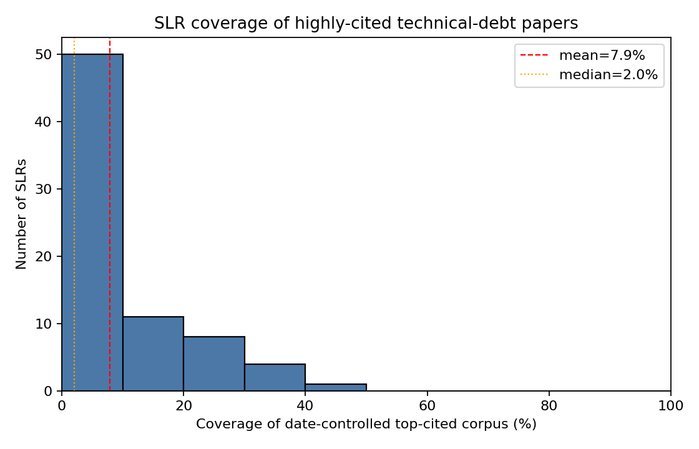
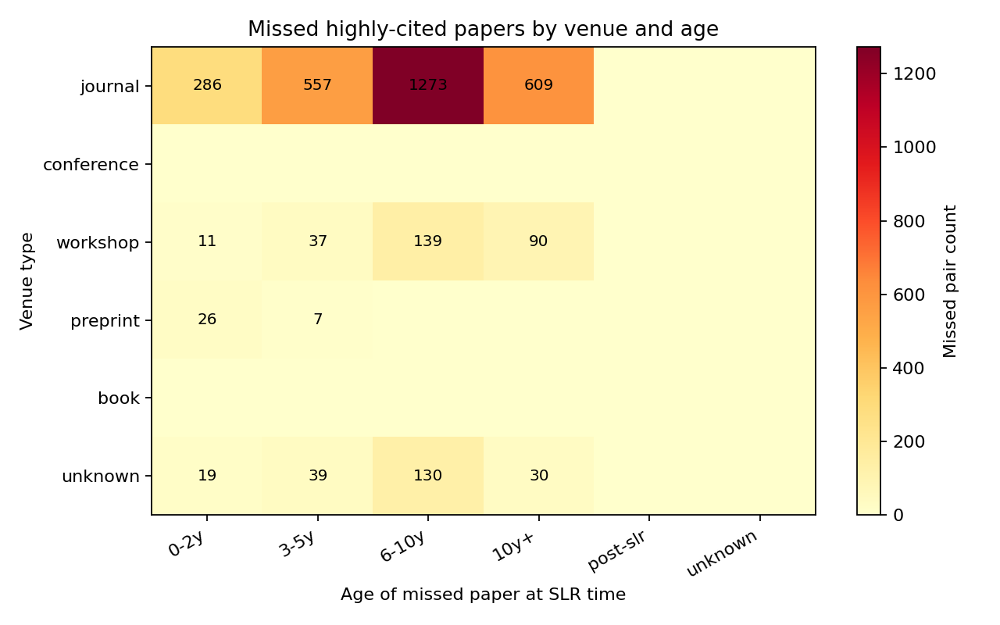

# Do Systematic Literature Reviews Cite the Right Papers?
## A Citation-Coverage Audit of Technical-Debt SLRs

**Authors:** Connor Tessaro, Lloyd Thomas, Jaden Zhou (Khoury College of Computer Sciences, Northeastern University)
**Source code + data:** [github.com/connortessaro/slr-citation-audit](https://github.com/connortessaro/slr-citation-audit)
**Subfield:** Technical debt
**Status:** Final draft (all numbers verified against `data/processed/ss/` as of June 2026)

---

## Abstract

Systematic Literature Reviews (SLRs) claim to deliver comprehensive, unbiased coverage of a research area. This study asks a narrower but consequential question: do SLRs in the technical-debt subfield actually cite the papers that the wider community most heavily relies on? We identified 60 peer-reviewed SLRs and systematic mapping studies published between 2015 and 2026, extracted their reference lists from Semantic Scholar with a Crossref fallback, and independently constructed a two-pass top-50 most-cited paper list (25 established works published on or before 2022, 25 recent works from 2023–2026) using Semantic Scholar citation counts. With year-of-publication date controls applied, mean coverage of the top-cited corpus across SLRs was 10.5% (median 4.4%, range 0–40%); 24 of 60 SLRs (40%) cited none of the eligible top-50 papers. Gaps clustered in journal venues (90.4% of 1,859 missed pairs) and showed a dual age peak — papers 6–10 years old at SLR time accounted for 34.8% of misses, and papers 0–2 years old for a further 32.0%. Forty-three percent of missed papers were open-access, suggesting access barriers explain only a limited share of the gap. The headline finding is robust under a top-100 benchmark (mean drops to 8.6%). The analysis is Semantic Scholar end-to-end; ACM bronze BibTeX exports were collected for traceability but not used in the reported overlap. We discuss methodological implications and offer protocol-level recommendations to improve coverage in future SLRs.

## 1. Introduction

SLRs are positioned as the most rigorous form of literature synthesis in software engineering, following protocols such as Kitchenham & Charters [1] and the PRISMA reporting guidelines [2]. They promise to surface a representative, unbiased view of a research area. If that promise holds, the most consequential primary studies — those the community most heavily cites — should appear in the reference lists of well-conducted SLRs.

This study tests that promise within a single, well-defined subfield: technical debt. Technical debt is an attractive testbed because:

- it has a strong SLR tradition (multiple SLRs and systematic mapping studies since 2015, with the metaphor itself dating to Cunningham [3]),
- it spans more than a decade of primary literature, and
- its scope is reasonably bounded by a small set of multi-word phrases (excluding broader software-engineering surveys).

During the project we revised the identification methodology three times — dropping a "methodology-signal" gate that had been excluding non-PRISMA-worded SLRs, adding a Crossref backfill for SLRs whose references were not indexed by Semantic Scholar, and widening the secondary-study self-label patterns to cover terms such as *literature review*, *scoping review*, and *survey* alongside the strict *systematic ...* family. Each revision is documented under `docs/changes/` with rationale and effect on corpus size. We surface them here so readers can judge the inclusion criteria transparently.

Our research questions are:

- **RQ1.** What proportion of the top-50 most-cited technical-debt papers (with date controls) appears in each published SLR?
- **RQ2.** Where coverage gaps exist, are they explained by venue type, publication age relative to the SLR, open-access status, or DOI block (ACM vs IEEE)?
- **RQ3.** What practical implications do the observed gaps carry for how SLRs in this subfield should be conducted?

## 2. Method

### 2.1 Subfield definition

We treated technical debt as the set of papers using the terms *technical debt*, *design debt*, *code debt*, or *architectural debt* as the primary topic (not in passing). Concrete inclusion criteria are documented in `data/manual/CLASSIFICATION.md`.

### 2.2 SLR identification

We queried Semantic Scholar via 16 API searches over the period 2000–2026 — each subfield keyword crossed with each of three systematic-review phrases ("systematic literature review", "systematic review", "systematic mapping"), plus four broad keyword-only searches with a title-pattern post-filter. ACM Digital Library bronze BibTeX exports were collected for traceability (`data/raw/acm_exports/`), parsed, and deduplicated against the SS pool, but **the reported overlap is computed from Semantic Scholar alone**. ACM and IEEE end-to-end overlap runs are noted as future cross-validation, not as part of this analysis.

All candidates were deduplicated on a key derived from DOI, then Semantic Scholar `paperId`, then a normalised title. Each candidate was then classified per the rubric in §2.3.

### 2.3 SLR classification

A candidate is included in the SLR corpus only if **all** of the following hold:

1. The title or abstract mentions a subfield keyword.
2. The title or abstract contains a secondary-study self-label. We widened this pattern in June 2026 to include the systematic family plus *literature review*, *scoping review*, *scoping study*, *mapping study*, the abbreviation *SLR*, *survey*, *tertiary review/study*, and *meta-analysis* (see `docs/slr_identification_gates.md`). The change responded to a finding that several pre-2015 technical-debt syntheses self-label as *survey* or *literature review* but not *systematic ...*; the strict gate had been excluding them on wording alone.
3. Publication year falls in the configured bounds 2000–2026.
4. The candidate has an extractable reference list after Semantic Scholar extraction and Crossref fallback (§2.4). SLRs with no bibliography are excluded from the analysis corpus because coverage is undefined without references.

**Trade-off on widened labels.** Patterns such as *survey* and *literature review* raise recall but admit narrative reviews without strict protocols. We accept that for this audit because (i) the subfield-keyword gate removes most off-topic noise, and (ii) the research question is bibliographic coverage, not quality appraisal of review methodology. A poorly-conducted narrative survey that omits influential citations is still informative for RQ1. We re-state this trade-off as a limitation in §6.

Per-candidate decisions and justifications are recorded in `data/manual/ss/slr_decisions.csv`.

### 2.4 Reference extraction

For each included SLR we queried Semantic Scholar's `/paper/{id}/references` endpoint, paginating to exhaustion. Each cited paper was normalised to a `(paper_key, title, year, venue, doi, citationCount, openAccessPdf)` record, and per-SLR results were cached locally so re-runs do not re-hit the API. Where Semantic Scholar returned an empty reference list, we attempted a **Crossref backfill** against the SLR's DOI (`docs/changes/2026-05-28-crossref-reference-backfill.md`). SLRs that still had no bibliography after both sources were **excluded** from the analysis corpus. The resulting funnel — 8,417 raw SS candidates → 110 auto-INCLUDE → 60 SLRs in the analysis corpus — is reported in §3.1.

### 2.5 Top-cited corpus construction

The Semantic Scholar search API does not support "rank by citations" directly. We therefore issued a wide keyword search (limit = 1,000 per keyword), pooled the results, deduplicated by `paper_key`, and filtered to papers whose title or abstract included a subfield keyword. The resulting discovery pool contained 958 papers.

To avoid a single lifetime-citation ranking favouring older papers, we constructed the benchmark with a **two-pass** design (full detail in `docs/top_cited_methodology.md`):

1. **Established pass** — papers with publication year ≤ `as_of_year − 4` (i.e. ≤ 2022 when `as_of_year = 2026`), ranked by Semantic Scholar `citationCount`, take 25. Pool size 781.
2. **Recent pass** — papers from the subsequent four calendar years, same ranking, take 25. Pool size 177.

The union (N = 50) is written to `top_cited_techdebt.json`; each record is tagged with `_pass` (established / recent). Citations across the top-50 range from 1,437 at rank 1 to 12 at rank 50. A parallel two-pass list with N = 100 (rank-100 cutoff: 9 citations) supports the robustness check reported in §3.2.

**Why not a recent-only benchmark.** Skewing the benchmark toward recent papers would change the research question from "do SLRs cite canonical TD literature" to "do SLRs cite recent hot papers." The two-pass design balances accumulated influence and recent momentum without abandoning the older highly-cited work that defines the subfield. The trade-off is explicit and documented.

### 2.6 Overlap computation with date controls

For each SLR, the top-cited corpus was filtered to papers with publication year ≤ the SLR's publication year. This date control prevents counting a paper as "missed" if it did not yet exist when the SLR was written. We then computed `coverage_pct = hits / eligible_top_n`, where `hits` is the number of date-eligible top-cited papers appearing in the SLR's references. Reference matching uses `paper_key` (DOI → SS paperId → normalised title).

### 2.7 Gap explanation

For each *(SLR, missed top-cited paper)* pair, we attached:

- `venue_type`: journal / conference / workshop / preprint / book / unknown, derived from Semantic Scholar `publicationTypes` and venue-string heuristics.
- `year_delta`: SLR year minus paper year.
- `age_bucket`: 0–2y / 3–5y / 6–10y / 10y+ / post-slr / unknown.
- `open_access`: presence of `openAccessPdf.url`.
- `in_acm`, `in_ieee`: DOI prefix block (`10.1145`, `10.1109`).
- `is_top10`: rank ≤ 10 in the global top-cited corpus.

### 2.8 Tooling

All analysis is implemented in Python and reproducible from the per-source pipeline scripts. The Semantic Scholar client wrapper (`core/ss_client.py`) persistently caches API responses to `data/raw/ss_cache/` so the full pipeline can be re-run idempotently. The interactive overlap explorer (`tools/explorer/`) recomputes coverage in-browser when the benchmark size or SLR cohort toggle changes.

## 3. Results

### 3.1 SLR corpus overview

We identified 8,417 unique Semantic Scholar candidates and 110 met the inclusion criteria after the classification gates. After reference extraction with Crossref fallback, 50 of those 110 candidates had no extractable bibliography and were dropped; the **final analysis corpus is N = 60 SLRs**. The corpus spans 2015–2026 and is composed of 39 systematic literature reviews, 19 systematic mapping studies, and 2 surveys.

**Field-emergence finding.** Of the 8,417 SS candidates, 1,875 fall in the years 2000–2014. **None** of these pass both the subfield-keyword gate and the (widened) secondary-study self-label gate. The pre-2015 records in the pool are primary empirical studies, workshop short papers, and position pieces — not self-labelled syntheses. This aligns with manual Semantic Scholar UI searches (~1,880 hits for 2000–2015) and we treat it as a finding about the field rather than a pipeline failure: the technical-debt SLR tradition emerges around 2015, after Li, Avgeriou, and Liang's systematic mapping study [5] established the subfield's secondary-literature canon.

### 3.2 Coverage of top-cited papers

Across 60 SLRs the date-controlled coverage of the top-50 most-cited technical-debt papers ranged from 0% to 40%, with a mean of 10.5% and a median of 4.4%. The distribution is right-skewed: most SLRs cite only a small fraction of the eligible top-50, while a minority of well-grounded reviews cluster above 20%.



A striking subgroup of the corpus shows **zero coverage**: 24 of 60 SLRs (40%) cite none of the eligible top-50 papers in their reference lists. The finding is not driven by a few outliers — it is the modal outcome.

**Cohort effect.** Coverage falls sharply with SLR publication year:

| Cohort | n | Mean | Median |
|---|---:|---:|---:|
| 2015–2019 | 11 | 20.3% | 25.0% |
| 2020–2026 | 49 | 8.3% | 2.0% |

The earlier cohort averages roughly 2.5× the coverage of the later one. The effect is partly **mechanical**: by later publication years more benchmark papers are date-eligible, so the denominator grows faster than any given SLR's reference list. It is partly a **quality signal**: the foundational 2015–2019 TD SLRs were written when the canonical primary literature was smaller and more cohesive, and those SLRs themselves became part of that canon.

**Robustness.** A parallel run with the top-100 benchmark produces a mean coverage of 8.6% (median 3.5%); the headline finding is robust to the chosen corpus size. Mean coverage drops because the larger denominator grows faster than additional hits.

### 3.3 Gap characterisation

We enriched 1,859 *(SLR, missed paper)* pairs with venue, age, and access features.



The most-missed venue type is **journal**, accounting for 90.4% (1,681 of 1,859) of all gaps; preprints are 3.1% (58), and an unknown bucket accounts for the remaining 6.5% (120). Conference and workshop misses are negligible after venue-type normalisation. The journal-dominance result argues against a simple "conference-visibility" explanation for missed citations.

**Dual age peak.** Missed papers cluster at two ages relative to SLR publication:

- 6–10 years old at SLR time: 34.8% (647 missed pairs)
- 0–2 years old at SLR time: 32.0% (594 missed pairs)
- 3–5 years: 18.5% (343 missed pairs)
- 10+ years: 14.8% (275 missed pairs)

The 6–10y peak is consistent with an "assumed-known foundations" pattern (older canonical work that SLRs implicitly treat as background rather than cite explicitly). The 0–2y peak is consistent with a "recency penalty" (newly published work that the SLR's search snapshot may have missed or that had not accumulated visibility in time). Both stories appear in the same data.

**Open-access status.** Of all missed papers, 43.0% (800) had an `openAccessPdf.url` recorded by Semantic Scholar at the time of analysis. Access barriers therefore explain only a limited share of the gap: SLRs are missing freely-readable canonical papers nearly as often as paywalled ones.

**Top-10 subset.** Of the 1,859 missed pairs, 484 involve papers in the global top-10 of the citation ranking — i.e., the most influential primary studies are being missed at scale, not merely the long tail.

## 4. Discussion

### 4.1 Plausible drivers of the gap

Several mechanisms could plausibly produce the systematic gap we observe:

- **Venue invisibility.** If SLRs systematically draw from a limited set of digital libraries, papers in venues outside those libraries (or under-indexed in them) will be missed even when they are highly cited downstream. Our 90.4%-journal finding constrains this story: the misses are concentrated in mainstream peer-reviewed venues, not in obscure proceedings.
- **Recency penalty and assumed-known foundations.** The dual age peak suggests two distinct mechanisms operating together. Papers published shortly before an SLR may not have accumulated enough citations or visibility to be picked up by the SLR's search protocol; conversely, older foundational papers may be implicitly treated as background and omitted from citations. Neither effect alone explains the pattern.
- **Protocol blind spots.** Even well-documented protocols depend on keyword choices that may miss papers using adjacent terminology (e.g. *design debt* vs *technical debt*) or that pre-date the dominant subfield label.

The **cohort effect** in §3.2 is partly mechanical (longer literature → larger denominator) and partly a quality signal. We treat it as evidence that newer SLRs are not necessarily worse-conducted, but that the bar for "comprehensive coverage" has risen with the field.

The journal-dominance, 43%-OA, and top-10-miss findings together suggest that the gap is **not** primarily explained by venue access, paywalls, or obscurity of the missed papers. It is a citation-protocol gap, not an information-access gap.

### 4.2 What this is not

We cannot determine from this analysis whether the *conclusions* of any individual SLR are wrong. A gap in citation coverage does not imply a flawed synthesis: an SLR may legitimately exclude a paper that is highly-cited but methodologically off-topic for its scope. The finding is at the level of **input coverage**, not **output validity**. Subsequent work would need to read each missed top-cited paper against each SLR's inclusion criteria to determine whether the omission was substantively justified.

## 5. Implications for SLR practice

Four concrete recommendations follow from the findings, each grounded in a specific evidentiary point above:

1. **Backward snowballing is non-optional.** Adding at least one round of backward snowballing from a small seed set of well-known papers catches venue-invisible work that keyword search misses [10]. The field-emergence finding (§3.1) supports this directly: pre-2015 technical-debt material exists in the candidate pool but does not surface via keyword + secondary-study search, because it pre-dates the dominant labels.
2. **Citation-aware quality check.** After applying inclusion criteria, cross-check the candidate set against a top-N most-cited list in the subfield; flag any high-citation paper that the protocol excludes and document the reason. The 24/60 zero-coverage finding shows that 40% of SLRs would have flagged a non-empty set of missing canonical work under this check.
3. **Multi-source dedup.** Use at least three digital libraries plus a citation-graph source (e.g. Semantic Scholar) to mitigate single-source coverage gaps. Our SS-only scope (§2.2) makes this recommendation especially relevant — we cannot claim our headline number is what would have emerged from a fully cross-validated multi-source run, and we say so.
4. **Time-window honesty.** Distinguish "we excluded this paper" from "this paper post-dated our search." The cohort effect (§3.2) shows that newer SLRs face a structurally larger eligibility set; readers cannot assess validity without that distinction made explicit in the report.

## 6. Limitations

- **Single citation source.** We use Semantic Scholar for citation counts and reference extraction. ACM, IEEE, and Google Scholar produce different counts; our top-50 may differ from a top-50 built from another source. ACM bronze exports were collected but not analysed end-to-end for overlap.
- **Search ceiling.** The top-cited ranking only considers papers in the Semantic Scholar keyword-search top 1,000 per query, not the full literature. Highly-cited papers that fall outside this pool cannot enter the benchmark.
- **No field normalisation.** We use raw `citationCount`, not OpenAlex's field-weighted citation impact (FWCI). Raw counts overweight older venues with longer time to accrue citations; the two-pass benchmark partially mitigates this by reserving 25 slots for recent work, but does not eliminate it.
- **Widened review labels.** Accepting *survey* and *literature review* alongside *systematic ...* raises recall but admits narrative reviews without protocol documentation. A poorly-conducted narrative review missing influential citations is still informative for RQ1, but a different study scoped to SLR-quality would need a stricter gate.
- **Manual classification subjectivity.** The SLR-vs-narrative-survey boundary is fuzzy; another reviewer may classify differently. Our rubric and per-paper justifications are published for inspection in `data/manual/ss/slr_decisions.csv`.
- **Subfield boundary.** Choosing "technical debt" as the unit aggregates over sub-strands (self-admitted technical debt, architectural debt, requirements technical debt) that may behave differently.
- **English-language indexing and metadata gaps.** Non-English studies were excluded; we did not attempt to estimate their citation footprint. Empty-bibliography SLRs were excluded by construction (50 of 110 auto-INCLUDEs), which biases the analysis corpus toward better-indexed venues.
- **Citation counts are point-in-time.** Counts grow over time; the date control mitigates the eligibility filter but not the underlying ranking volatility.
- **Coverage ≠ validity.** Low coverage does not prove incorrect SLR conclusions, only that the input citation base differs from the community consensus on most-cited primary work.

## 7. Conclusion

Within the technical-debt subfield, published SLRs cite, on average, 10.5% of the date-eligible top-50 most-cited papers, with a median of 4.4%. Forty percent of SLRs cite none of the eligible top-50. Gaps are systematic — concentrated in journal venues (90.4% of misses), peaking at both 6–10-year-old foundations and 0–2-year-old recent work, and not primarily explained by paywalls (43% of missed papers are open-access). The findings are robust under a top-100 benchmark (mean drops only to 8.6%).

A small set of protocol additions — backward snowballing from canonical seeds, citation-aware cross-checks against a top-N benchmark, multi-source deduplication, and explicit time-window framing — would materially close the gap. Readers of SLRs in this subfield should not assume comprehensive coverage by default; reviewers and editors should ask SLR authors to demonstrate it.

## Acknowledgments

The authors thank Prof. Ian Gorton for advising the project and for methodological feedback that shaped the two-pass top-cited corpus design (§2.5, §3.2). We also acknowledge the Semantic Scholar Open API and the Crossref REST API for free access to the citation and reference-graph data this study depends on.

## References

[1] B. Kitchenham and S. Charters, "Guidelines for performing systematic literature reviews in software engineering," Keele University and Durham University Joint Report, EBSE 2007-001, 2007.

[2] D. Moher, A. Liberati, J. Tetzlaff, D. G. Altman, and the PRISMA Group, "Preferred reporting items for systematic reviews and meta-analyses: the PRISMA statement," *PLoS Medicine*, vol. 6, no. 7, e1000097, 2009.

[3] W. Cunningham, "The WyCash portfolio management system," in *Proc. ACM OOPSLA Addendum*, 1992.

[4] P. Kruchten, R. L. Nord, and I. Ozkaya, "Technical debt: From metaphor to theory and practice," *IEEE Software*, vol. 29, no. 6, pp. 18–21, 2012.

[5] Z. Li, P. Avgeriou, and P. Liang, "A systematic mapping study on technical debt and its management," *Journal of Systems and Software*, vol. 101, pp. 193–220, 2015.

[6] N. A. Ernst, S. Bellomo, I. Ozkaya, R. L. Nord, and I. Gorton, "Measure it? Manage it? Ignore it? Software practitioners and technical debt," in *Proc. 10th Joint Meeting on Foundations of Software Engineering (ESEC/FSE)*, 2015, pp. 50–60.

[7] D. Sculley, G. Holt, D. Golovin, E. Davydov, T. Phillips, D. Ebner, V. Chaudhary, M. Young, J.-F. Crespo, and D. Dennison, "Hidden technical debt in machine learning systems," in *Advances in Neural Information Processing Systems (NeurIPS)*, 2015, pp. 2503–2511.

[8] V. Lenarduzzi, T. Besker, D. Taibi, A. Martini, and F. Arcelli Fontana, "A systematic literature review on technical debt prioritization: Strategies, processes, factors, and tools," *Journal of Systems and Software*, vol. 171, 110827, 2021.

[9] W. N. Behutiye, P. Rodríguez, M. Oivo, and A. Tosun Misirli, "Analyzing the concept of technical debt in the context of agile software development: A systematic literature review," *Information and Software Technology*, vol. 82, pp. 139–158, 2017.

[10] C. Wohlin, "Guidelines for snowballing in systematic literature studies and a replication in software engineering," in *Proc. 18th Int'l Conf. on Evaluation and Assessment in Software Engineering (EASE)*, 2014, art. 38.

[11] P. Avgeriou, P. Kruchten, I. Ozkaya, and C. Seaman, "Managing technical debt in software engineering (Dagstuhl Seminar 16162)," *Dagstuhl Reports*, vol. 6, no. 4, pp. 110–138, 2016.

---

### Replicability

All code, classifications, and intermediate data live in this repository. The full SS-only pipeline can be re-run end-to-end:

```bash
python -m venv .venv && source .venv/bin/activate
pip install -r requirements.txt
cp config/subfield.example.yaml config/subfield.yaml
export SEMANTIC_SCHOLAR_API_KEY=...        # optional, raises rate limits
export CROSSREF_MAILTO=you@example.com     # optional, Crossref polite pool

PYTHONPATH=. python sources/ss/run.py
```

Per-stage scripts are documented in `README.md`. Static figures are regenerated via `PYTHONPATH=. python report/build_figures.py --source ss`. The interactive overlap explorer is launched with `python tools/explorer/serve.py` (see `tools/explorer/README.md`). Re-running the pipeline should reproduce the numbers above, subject to Semantic Scholar's evolving citation graph.
